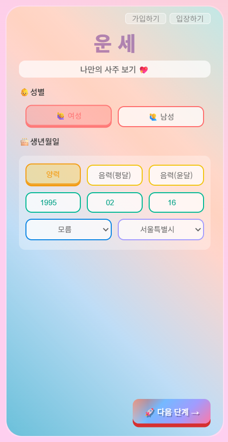
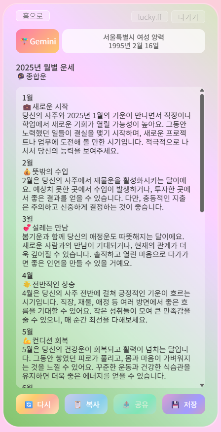

# 🍀 Lucky Log 🍀

> AI 기반 운세 예측을 기록하고 실제 결과와 비교할 수 있는 웹 플랫폼

## 📖 프로젝트 소개

Lucky Log는 AI를 활용하여 운세를 예측하고 저장하는 서비스입니다.  
실제 일어난 일과 비교하며 운세의 정확도를 확인할 수 있습니다.

**🔗 서비스 주소 [🔮LUCKY LOG](https://lucky-log.duckdns.org/)**

## ✨ 핵심 기능

### 1. 운세

- 👀 **운세 조회**: AI(Gemini)를 활용한 올해의 운세 예측
- 🙌 **운세 종류 선택**: 연애운/금전운/취업운 등 원하는 운세 타입 선택
- 💾 **운세 저장**: 조회한 운세를 내 계정에 저장
- 📖 **운세 기록**: 저장된 운세 기록 조회
- 📋 **운세 결과 복사**: 운세 결과를 간편하게 복사

### 2. 유저 & 인증

- 🔐 **로그인**
- 💌 **회원 가입**: 간단한 가입 후, 운세 저장 기능 사용

## 📸 주요 화면





## 🛠️ 기술 스택

### Backend

- **Language**: Java 17
- **Framework**: Spring Boot 3.5.3
- **ORM**: Spring Data JPA
- **Security**: Spring Security
- **Database**: H2 (개발) / MySQL (운영)
- **API Documentation**: Swagger UI (SpringDoc OpenAPI 2.8.6)

### Frontend

- **Template Engine**: Thymeleaf
- **JavaScript**: Vanilla JS (ES6+)
- **Styling**: CSS3

### Infra

- **Cloud**: AWS EC2, AWS RDS, AWS ElastiCache
- **DevOps**: GitHub Actions
- **Monitoring**: Spring Boot Actuator

### External Services

- **AI API**: Google Gemini API 1.12.0

### DevOps

- **Build Tool**: Gradle
- **Testing**: JUnit 5
- **Version Control**: Git

## 🏗️ 아키텍쳐


## 🩺 기술 선택 과정 및 문제 해결

개발 과정에서 기술 선택의 이유와 발생한 주요 문제들을 기록했습니다.  
아래 Wiki에서 의사결정 흐름과 해결 과정을 확인할 수 있습니다.

👉 [Wiki](https://github.com/HJ0216/lucky-log/wiki/Tech-Decision-&-Troubleshooting)

## 📚 API 문서

**Swagger UI**: [API 문서](https://lucky-log.duckdns.org/swagger-ui/index.html)

> 🔒 인증이 필요한 API는 먼저 [로그인](https://lucky-log.duckdns.org/login)을 해야합니다.

## 📂 디렉터리 구조

```txt
src
├─java
│  └─com
│      └─fortunehub
│          └─luckylog
│              ├─client # 외부 API
│              │  └─gemini
│              ├─common
│              ├─config # 설정 파일
│              ├─controller # 웹 컨트롤러
│              │  ├─api
│              │  │   └─fortune
│              │  └─web
│              │      ├─auth
│              │      │  └─form
│              │      └─fortune
│              │          └─form
│              ├─domain # 도메인 엔티티
│              │  ├─common
│              │  ├─fortune
│              │  └─member
│              ├─dto # 데이터 전송 객체
│              │  ├─request
│              │  │  ├─auth
│              │  │  └─fortune
│              │  └─response
│              │      ├─common
│              │      └─fortune
│              ├─exception # 예외 처리
│              ├─init # local용 초기 데이터
│              ├─repository # 데이터 처리
│              │  ├─fortune
│              │  └─member
│              ├─security # 인증, 인가
│              └─service # 비즈니스 로직 처리
│                  ├─auth
│                  └─fortune
└─resources
    ├─static
    │  ├─css
    │  │  ├─auth
    │  │  ├─common
    │  │  └─fortune
    │  ├─images
    │  └─js
    │      ├─auth
    │      ├─common
    │      └─fortune
    └─templates # thymeleaf 템플릿
        ├─auth
        ├─error
        ├─fortune
        └─fragments
```

## 🗄️데이터베이스 설계


## 🎫 Local 환경에서의 실행

1. 프로젝트 클론

```bash
https://github.com/HJ0216/lucky-log.git
```

2. 환경변수 설정

- `SPRING_PROFILES_ACTIVE=local` profile 설정
- `application.yaml` 관련 환경 변수 설정
- `application-prompts.yaml` 파일 추가

3. Docker 기반 개발 환경 실행

```bash
docker compose -f docker-compose.dev.yaml up -d
```

4. 프로젝트 실행

## 📜 Git 전략

- `main`: 프로덕션 배포
- `develop`: 개발 통합
- `feature`: 신규 기능 개발
  - `feature/signup`, `feature/login`
- `refactor`: 코드 리팩토링
  - `refactor/ui`
- `fix`: 버그 수정
  - `fix/signup-error`

## 🗒️ 커밋 컨벤션

| Emoji | Type     | Description      |
| ----- | -------- | ---------------- |
| 🎉    | Init     | 프로젝트 시작    |
| ✨    | Feat     | 새로운 기능 추가 |
| 🐛    | Fix      | 버그 수정        |
| 📝    | Docs     | 문서 수정        |
| 🎨    | Style    | 코드 포매팅      |
| 💄    | Design   | UI 디자인 변경   |
| ✅    | Test     | 테스트 코드      |
| ♻️    | Refactor | 코드 리팩토링    |
| 🧹    | Chore    | 기타 수정        |
| 🚚    | Rename   | 파일/폴더명 수정 |
| 🔥    | Remove   | 파일 삭제        |

**커밋 메시지 형식**

- `<emoji><Type>: #<이슈번호> <설명>`
- ✨Feat: #12 회원가입 기능 추가
